## Constats de départ

- Interdépendance traitement des données & programmation scientifique
- Depuis 2012 : nouveau format de [notebooks computationnels](https://docs.jupyter.org/en/latest/what_is_jupyter.html)
    - Comme pour les tableurs, un mélange de concepts & de logiciels
    - Pratique & enseignement

::: {.callout-note}

## Question

La place de ces notebooks computationnels + favorisent-ils la reproductibilité des traitements de données ?

:::

*Expérience personnelle, réflexions dans le projet NOOS (avec Mariannig Le Béchec, Célya Gruson-Daniel et Clémence Lascombes) et le [GT Notebooks](https://gt-notebook.gitpages.huma-num.fr/site_quarto/)*

---

## Le périmètre (large) des notebooks computationnels

::: {.columns}

::: {.column width="40%"}

**De quoi parle-t-on ?** Un format qui lie code et contenu inspiré de la programmation lettrée (*literate programming*) reposant sur un environnement d'exécution

- Des notebooks interactifs avec kernel : Mathematica, Jupyter, Marimo…
- Des notebooks statiques à compiler : Quarto, RMarkdown
- Des solutions intermédiaires : le cas de [Rmarkdown notebooks in RStudio](https://www.datacamp.com/blog/jupyter-and-r-markdown-notebooks-with-r)
- Des intégrations dans des [plateformes data](https://deepnote.com/compare) : Databricks, Deepnote, Kaggle…

:::

::: {.column width="60%"}

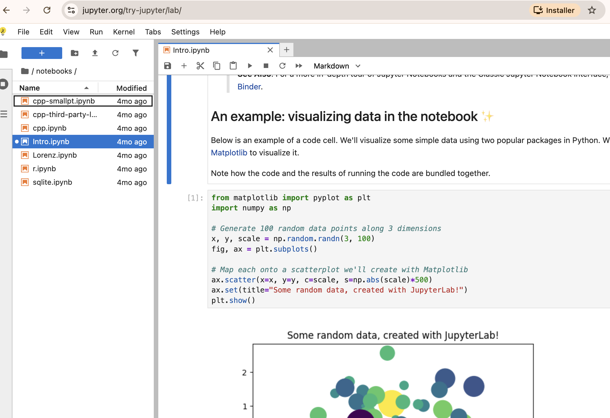{fig-align="center"}

:::

:::

---

## Les notebooks computationnels dans ma vie

Pas un usage unique mais un spectre de pratiques (en Python uniquement)

::: {.columns}

::: {.column width="60%"}

- Test de package/API
    - appel ollama, en local
- Doc de travail collaboratif
    - analyse des missions du laboratoire, sur Onyxia
- Support finalisé de formation
    - tutorial BERTOPIC sur un dépôt public

:::

::: {.column width="40%"}

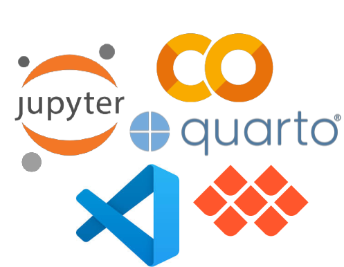{fig-align="center"}

:::

:::

Et en parallèle : des scripts, des fichiers markdown, etc.

---

## Quarante ans de notebooks computationnels

Remettre un peu en perspective d'un format

- **1988**: Mathematica : logiciels mathématiques interactifs
- **2001**: IPython : shell interactif scientifique
- **2011**: IPython Notebook : le format `.ipynb` en navigateur
- **2012**: Rmarkdown : le format `.Rmd`
- **2014**: Projet Jupyter : multi-langage, indépendance institutionnelle
- **2018**: JupyterLab : environnement modulaire
- **2017–2020**: Google Colab, MyBinder : le notebook devient un service
- **2023+**: IA générative, Marimo, agents : nouvelle vague

> Une histoire de glissements : du logiciel scientifique vers la plateforme grand public

---

## La centralité du projet Jupyter

Un format ancré dans la programmation scientifique venu de la recherche [@schultzLaboratoireJupyterTrajectoire2023].

::: {.columns}

::: {.column width="60%"}

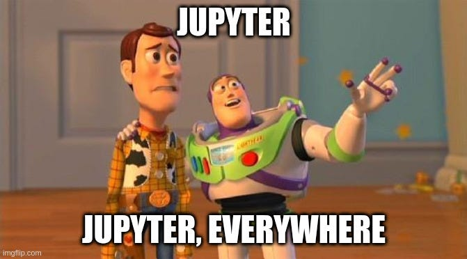{fig-align="center"}

:::

::: {.column width="40%"}

"If you typed Python in the command line, you got a, an interactive shell, it was a very, very primitive and it didn’t allow me to do the kinds of things that were very natural in interactive scientific workflows with tools like IDL or Mathematica that I used heavily or Matlab or Maple that other used which was simply to type a bit of code, see the results right there, open a plot, look at the files on, on the file system, et cetera." Fernando Pérez, 2012

:::

:::

---

## Une promesse "native" de reproductibilité

::: {.columns}

::: {.column width="50%"}

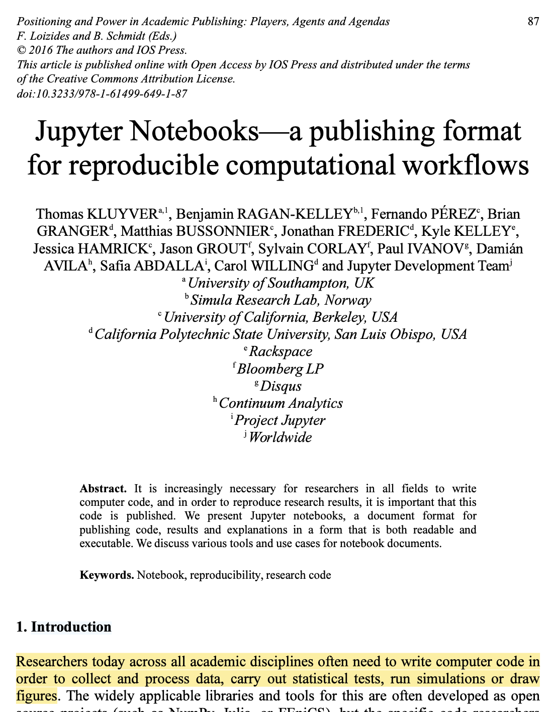{fig-align="center"}

:::

::: {.column width="50%"}

Avoir le code et les résultats rapprochent de la reproductibilité

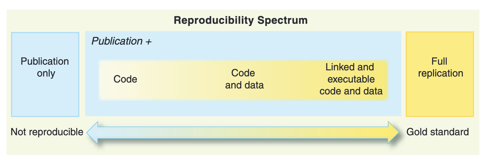{fig-align="center"}
:::

:::

---

## Une réflexion écosystémique de la reproductibilité

En lien avec les forges, les dépots de données, etc.

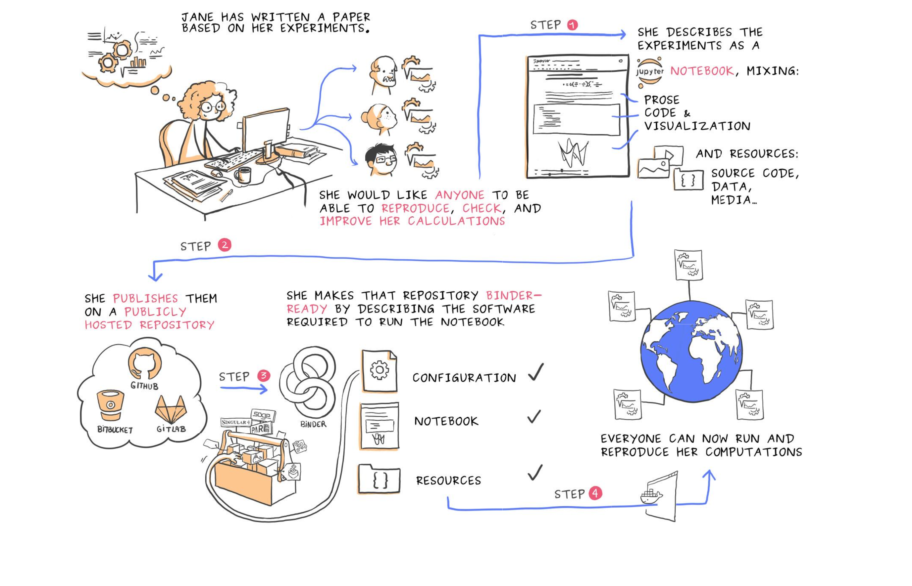{fig-align="center"}

---

## Une très forte popularité d'adoption

*Pourquoi ? De multiples facteurs, et une question ouverte*

- Pensé pour faciliter la boucle d'**interaction** code/résultat
- **Relaxe** beaucoup de contraintes (ce qui peut poser des problèmes)
- Permet une **trame narrative** qui facilite l'exposition (et l'enseignement)
- Facilite le **partage** du contenu (même s'il n'est pas exécuté, il reste lisible)
- Facilite l'accès à des **interfaces** (notamment sous forme de service)

> "I think notebooks are popular for the same reason that explains the popularity of spreadsheets such as Excel. I haven’t met a single software engineer who loves Excel. Everyone hates it and makes fun of it, but why do so many users still use it?"

---

## Le rôle d'interface des notebooks - le cas Google Colab

Accès à un écosystème + des ressources (dont GPU) depuis 2017 facilite les usages

](img/colab.png){fig-align="center"}

D'autres interfaces : HPC, etc. - le succès d'[Onyxia](https://www.onyxia.sh/)

---

## Une fragmentation de l'espace des notebooks

Qui double la diversité d'usages

::: {.columns}

::: {.column width="50%"}

**Format / exécution**

- Jupyter (interactif, *out-of-order*)
- Marimo (réactif, dépendances explicites)
- Quarto / RMarkdown (statique, oriente document)

:::

::: {.column width="50%"}

**Plateformes intégrées**

- Google Colab (gratuit, GPU, + Gemini)
- Databricks / Snowflake (entreprise, données)
- Hex / Deepnote (collaboratif, dashboards)

:::

:::

> Chaque combinaison déplace les compromis : reproductibilité, collaboration, accès aux données

---

## Utiliser des notebooks ? Un sujet polarisant

Notamment sur les aspects de reproductibilité

::: {.columns}

::: {.column width="50%"}
### [The First Notebook War](https://yihui.org/en/2018/09/notebook-war/#the-two-cultures-the-r-vs-python-culture-or-data-analysis-vs-software-engineering-culture)

{fig-align="center"}
:::

::: {.column width="50%"}

Tensions entre deux cultures : **ingénierie logicielle** et **analyse de données**

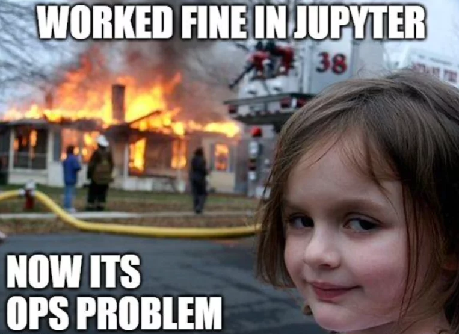{fig-align="center"}
:::

:::

---

## Une faible reproductibilité ?

::: {.columns}

::: {.column width="50%"}

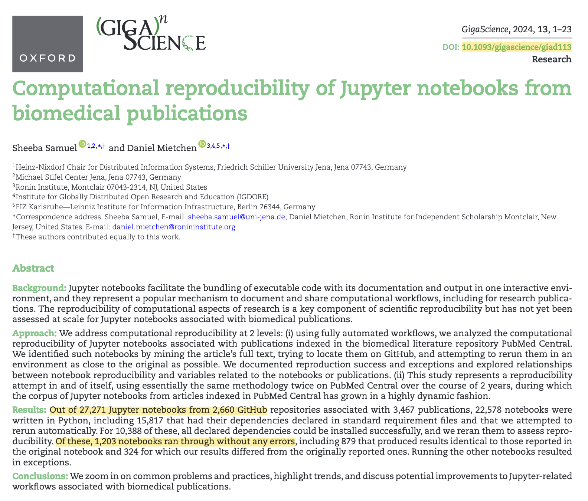{fig-align="center"}

:::

::: {.column width="50%"}

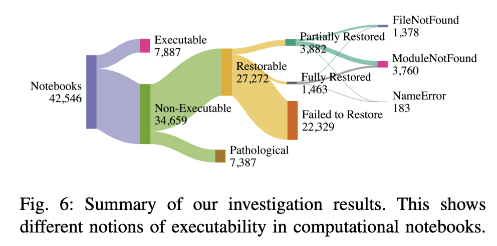{fig-align="center"}

Des degrés de reproductibilité : **paradigme spécifique aux notebooks interactifs** qui n'est pas celui des logiciels [@nguyenAreMajorityPublic2025].

:::

:::

---

## Une liste de griefs

Surtout vu des bonnes pratiques de la programmation (logicielle)

- Ordre d'exécution potentiellement différent (et accumulation du hidden state)
- Difficulté au versionnement de code
- Peu de gestion des dépendances
- Amène de nouveaux publics peu habitués aux bonnes pratiques de programmation
- ...

*(mais des critiques adressées en général à la programmation scientifique)*

---

## Des pratiques bien installées là pour rester

Les notebooks computationnels sont intéressants pour l'exploration et l'explicitation des traitements

{fig-align="center"}

---

## Des bonnes pratiques qui se stabilisent

Qui se rapprochent de pratiques générales de science ouverte

::: {.columns}

::: {.column width="50%"}

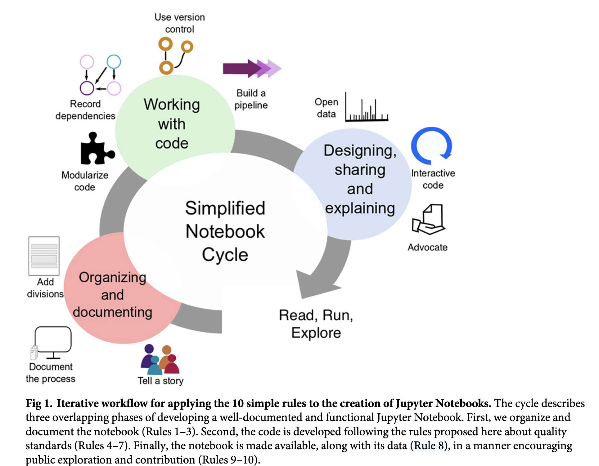{fig-align="center"}

:::

::: {.column width="50%"}

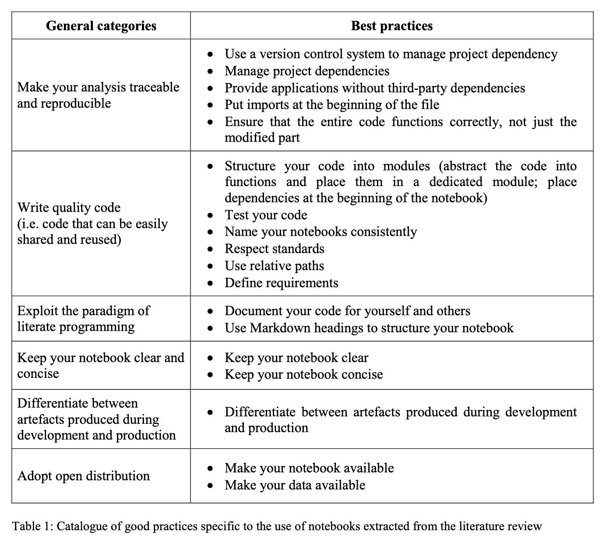{fig-align="center"}

:::

:::

---

## Au-delà des bonnes pratiques : tension exploration - explication

Un notebook computationnel est un artefact qui commence généralement comme un *scratch pad* (**exploration**) et peut, pour certains, finir comme un document complet (**explication**) — voire un livre avec [Jupyter Book](https://jupyterbook.org/) [@Rule2018]

> « We found that each task fit into one of three categories: **disposable exploration**, **findings**, and **artifact** » @huangHowScientistsUse2025

Les notebooks évoluent dans le temps [@Raghunandan2023] et à ce titre sont souvent des **objets intermédiaires**.

---

## Les notebooks sont (souvent) une vinaigrette

- Programmation lettrée : garder ensemble (et mélangé) réflexion et traitements
- Les notebooks doivent rester utilisés (agités) — sinon ils se figent et se cassent
- **Corollaire** : un notebook qui n'est plus exécuté n'est plus un notebook, c'est un document fossile
- Pour construire des archives durables, ou pour séparer les usages (aller vers des logiciels), peut-être pas le format le plus fort

> Il manque une sémantique pour marquer leur stade d'avancement

<!--

---

## Trois niveaux à distinguer

Le débat *"les notebooks c'est bien / mal"* mélange trois choses

1. **Le format d'interaction** — la combinaison code + texte + sorties (le `.ipynb` ou son équivalent)
2. **Le logiciel** — l'interface qui anime ce format (JupyterLab, VS Code, Colab, Marimo…)
3. **L'infrastructure** — où s'exécute le noyau (local, HPC, cloud managé, GPU à la demande)

Les arbitrages de reproductibilité, pérennité et collaboration **ne se prennent pas au même niveau**.

-->

---

## La question de la pérennité

Un format vivant n'est pas un format d'archive

- Le `.ipynb` mélange code, sorties et métadonnées d'exécution : tout évolue indépendamment
- Dépendance forte aux versions de bibliothèques, aux noyaux, aux interfaces
- Dix ans plus tard : moteur disparu, sorties figées, URLs cassées

**Pistes** : Software Heritage (archivage du code), Zenodo + DOI (versionner les livrables), conversion vers HTML/PDF au moment du dépôt

> Pérenniser un notebook = en sortir

---

## Ce qu'il manque actuellement

Beaucoup d'inconnues sur les pratiques (en général, et en particulier sur les notebooks)

- Les profils d'apprentissage de la programmation
    - Quel effet de commencer par des notebooks ?
- Les conditions de bifurcation & de cohabitation
    - Qu'est-ce qui déclenche le passage vers un autre format ? Comment les différents formats coexistent ?
- Les formes de réutilisation des notebooks
    - Comment sont utilisés les notebooks publics existants ?
- Les usages avancés
    - Comment se fait l'intégration dans d'autres outils : Quarto, Jupyter Book, etc. ?

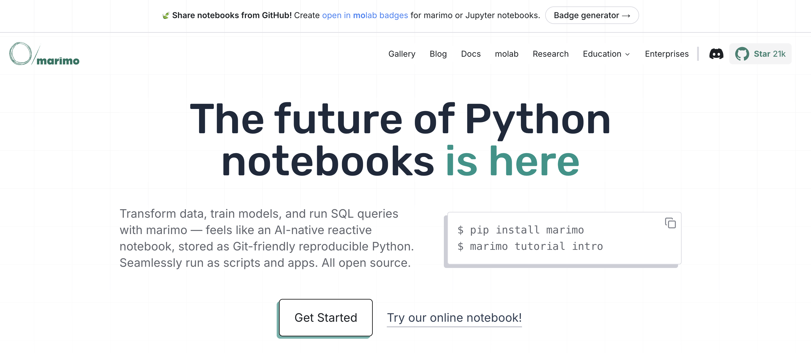{fig-align="center"}

---

## L'IA dans les notebooks — trois mouvements à distinguer

- **Copilotes intégrés** : Cursor, Colab + Gemini, JupyterAI — suggestion de code dans l'éditeur
- **Agents de notebook** : nb-cli, génération et exécution autonome de cellules
- **Le notebook comme contexte à prompt** : le non-code (markdown, sorties précédentes) devient ressource pour le LLM

](img/nbcli.png){fig-align="center" width="50%"}

**Opportunité** : un notebook non reproductible reste *réutilisable* si le prompt et le contexte sont lisibles [@nguyenAreMajorityPublic2025]

---

## Conclusion — une réponse mitigée

**Les notebooks favorisent-ils la reproductibilité ?** Oui et non, selon ce qu'on appelle « reproductibilité ».

- **Ce qu'ils favorisent** : trace explicite des étapes, diffusion conjointe code / résultats / narration, abaissement du coût d'entrée à l'analyse de données
- **Ce qu'ils fragilisent** : *hidden state* et ordre d'exécution, gestion des dépendances, ancrage dans des interfaces qui évoluent vite
- **Un paradigme propre** : pas la reproductibilité du logiciel, plutôt celle d'un *carnet de laboratoire* exécutable [@nguyenAreMajorityPublic2025]

---

## Conclusion — pistes pour bien les utiliser

- **Distinguer** format, logiciel et infrastructure : les arbitrages ne sont pas les mêmes
- **Reconnaître la diversité des usages** (du *scratch pad* à l'artefact) : un même outil, plusieurs régimes de qualité attendus
- **Garder l'humain au centre** : la valeur du notebook tient à la boucle interactive, pas au seul fichier `.ipynb`
- **Prévoir la sortie** du notebook :
    - en le finalisant (linéarisation, date, licence, environnement)
    - en le transformant en document ou en script quand l'usage se stabilise

> L'enjeu n'est pas de choisir *pour* ou *contre* les notebooks, mais de mieux outiller leurs **transitions** — du brouillon vers le partage, du partage vers l'archive.

---

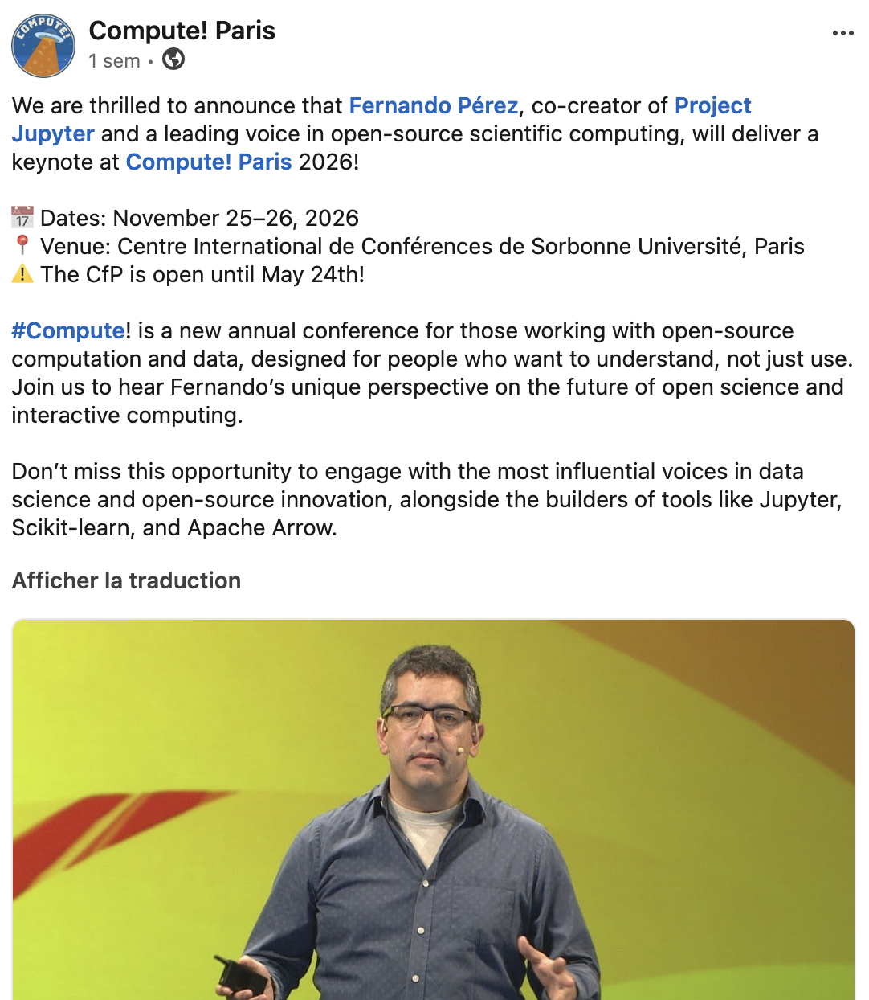{fig-align="center"}

---

## Références

::: {#refs}
:::

---

## Annexe : L'écosystème Jupyter

](img/ecosystemjupyter.png){fig-align="center"}

<!--

limiter la taille des notebooks
difficulté de faire des tests
accès GPU
-->